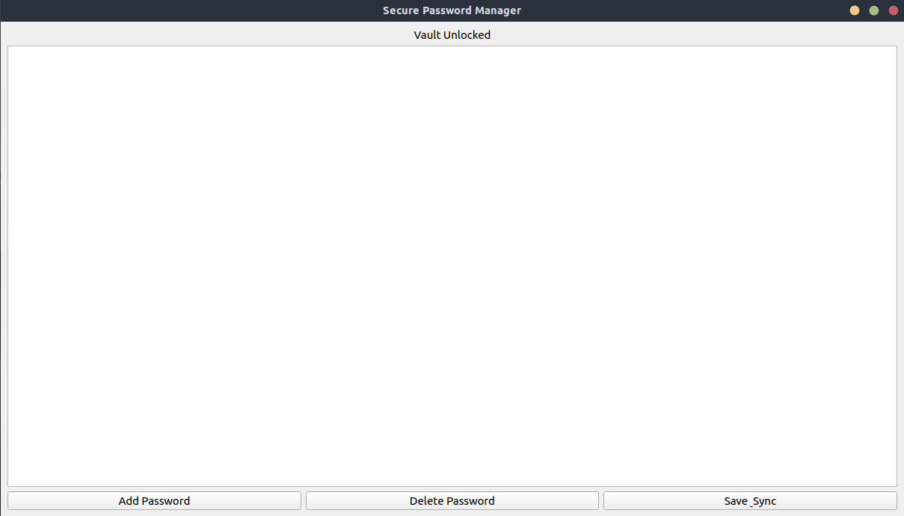

# Secure Cloud-Synced Password Manager

secure password manager built with Python and PyQt5. uses client-side encryption and Google Drive for free, cross-device synchronization.



## Features

- **Zero-Knowledge:**  master password and encrypted data wont leave the device
- **Strong Encryption:** uses AES-256-GCM for data encryption and PBKDF2 for key derivation.
- **Cloud Sync:** securely syncs your encrypted vault file across devices using your own Google Drive.
- **Cross-Platform:** the GUI is built with PyQt5 and can be packaged for Windows, macOS, and Linux.

## Setup & Installation

1.  **Clone the repository:**
    ```bash
    git clone https://github.com/ElijahFeldman7/PasswordManager
    cd PasswordManager
    ```

2.  **Install dependencies:**
    ```bash
    pip install -r requirements.txt
    ```

3.  **Configure Google Cloud API:**
    - Follow the official [Google guide](https://developers.google.com/workspace/guides/create-credentials) to enable the Google Drive API and get your `OAuth client ID` credentials.
    - Download the credentials JSON file.
    - **Rename it to `credentials.json` and place it in the project's root directory.**

## How to Run

Once setup is complete, run the application with:
```bash
python3 gui.py
